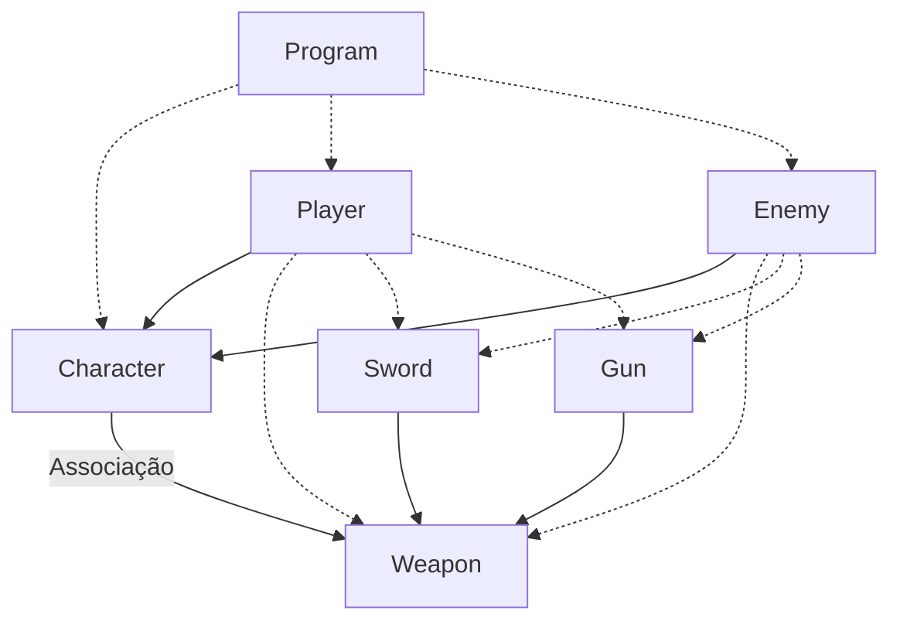

### Diagrama UML

```mermaid
flowchart TD;
A[Program]-.->B[Character];
A-.->C[Player];
A-.->D[Enemy];
C-->B;
D-->B;
C-.->E[Weapon];
C-.->F[Sword];
C-.->G[Gun];
D-.->E;
D-.->F;
D-.->G;
F-->E;
G-->E;
B-- Associação -->E;
```
